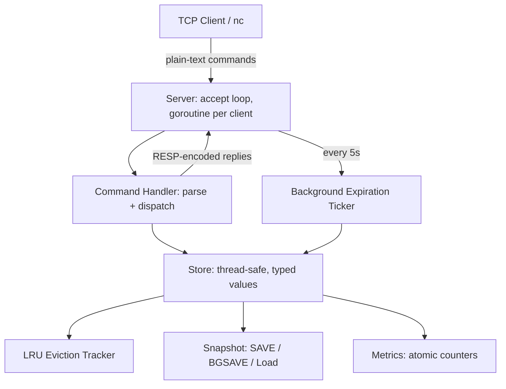

# GoCacheDB

**GoCacheDB is an educational, Redis-inspired in-memory key-value database implemented from scratch in Go.**

It was built to understand — by actually implementing — how in-memory databases, TCP networking, concurrency, caching, and persistence work internally. It is not a production database and does not claim compatibility with real Redis or its official client libraries.

## Features

- **TCP server** with a goroutine-per-connection concurrency model
- **Full data model**: Strings, Lists, Sets, and Hashes
- **Thread-safe** store, verified with Go's race detector (`go test -race`)
- **Key expiration (TTL)**: both lazy (checked on access) and active (background goroutine) expiration
- **LRU cache eviction** with a configurable max-key capacity, implemented with a HashMap + doubly linked list for O(1) get/set/evict
- **Persistence**: `SAVE` / `BGSAVE` snapshotting to disk with atomic (crash-safe) file writes, and automatic loading on startup
- **RESP-inspired protocol**: server responses are encoded using a real subset of Redis's RESP protocol (Simple Strings, Errors, Integers, Bulk Strings, Arrays)
- **Observability**: an `INFO` command reporting live uptime, command counts, cache hit/miss ratio, evictions, and connected clients
- Comprehensive automated test suite: unit tests, concurrency tests, real end-to-end TCP integration tests, and persistence round-trip tests
- Benchmarks measuring real throughput and revealing actual architectural tradeoffs (see [Benchmarks](#benchmarks) below)

## Architecture



**Package layout:**

```text
cmd/gocachedb/     entry point — wires store, metrics, and server together
internal/store/    the core key-value store: typed values, TTL, LRU, persistence
internal/command/  command parsing and dispatch, RESP-encoded responses
internal/server/   TCP server: accept loop, per-connection goroutines
internal/eviction/ standalone LRU cache (hashmap + doubly linked list)
internal/resp/     RESP protocol encoding (Simple String/Error/Integer/Bulk String/Array)
internal/metrics/  atomic counters for observability (INFO command)
```

## Getting started

Requires Go 1.22+.

```bash
git clone https://github.com/bhavithm41-prog/RedisInGo.git
cd RedisInGo
go run ./cmd/gocachedb
```

The server listens on port `6380` by default (intentionally different from Redis's default `6379`, to avoid conflicting with a real Redis installation).

Connect with any raw TCP client, e.g. `netcat`:

```bash
nc localhost 6380
```

## Usage examples

```text
SET name Bhavith
GET name
EXPIRE name 60
TTL name

RPUSH fruits apple banana
LRANGE fruits 0 -1

SADD tags go backend database
SISMEMBER tags go

HSET user:1 role engineer
HGET user:1 role

SAVE
INFO
```

Note: since server responses use RESP encoding, connecting with `nc` will show raw protocol bytes (e.g. `+OK\r\n`, `$5\r\nhello\r\n`) rather than plain text — this is the same wire format real Redis clients parse.

## Supported commands

| Category | Commands |
|---|---|
| Strings | `SET`, `GET`, `SETEX` |
| Generic | `DEL`, `EXISTS`, `KEYS`, `DBSIZE`, `FLUSHDB` |
| Lists | `LPUSH`, `RPUSH`, `LPOP`, `RPOP`, `LRANGE` |
| Sets | `SADD`, `SREM`, `SISMEMBER`, `SMEMBERS` |
| Hashes | `HSET`, `HGET`, `HGETALL`, `HDEL` |
| Expiration | `EXPIRE`, `TTL` |
| Persistence | `SAVE`, `BGSAVE` |
| Server | `PING`, `INFO` |

## Testing

```bash
go build ./...
go vet ./...
go test ./...
go test -race ./...
```

The test suite includes:
- Unit tests for command parsing and dispatch, with exact RESP byte-level assertions
- Concurrency tests using Go's race detector, including a test that reproduces and proves the fix for a real data race found during development
- Real end-to-end TCP integration tests that start an actual server on an OS-assigned port and connect real clients to it
- Persistence round-trip tests (save → load → verify) across every data type, plus graceful handling of missing/corrupted snapshot files
- LRU eviction correctness tests, verified in isolation and at the full store level

## Benchmarks

Run with:

```bash
go test ./internal/store/... -bench=. -benchmem -run=^$
```

Real results from development (AMD Ryzen 7 7445HS):

| Benchmark | ns/op | B/op | allocs/op |
|---|---|---|---|
| Set (sequential) | 105.2 | 29 | 2 |
| Get (sequential) | 87.3 | 13 | 1 |
| Set (parallel) | 214.7 | 30 | 2 |
| Get (parallel) | 206.3 | 13 | 1 |
| LPush | 210,271 | 299,211 | 3 |
| RPush | 135.5 | 108 | 1 |

Two notable, deliberate architectural tradeoffs these numbers reveal:

- **Get takes a full write lock, not a read lock.** Because expired keys are lazily deleted on access, `Get` needs to be able to mutate the store, so it can't use `sync.RWMutex`'s cheaper read-lock path. The ~2.4x slowdown under concurrent load (87ns → 206ns) is the measured cost of that correctness decision.
- **LPUSH is ~1,550x slower than RPUSH.** Lists are backed by a Go slice; prepending (`LPUSH`) requires shifting every existing element, an O(n) operation, while appending (`RPUSH`) is O(1) amortized. A production implementation would use a doubly-linked-list-based structure (similar to Redis's own "quicklist") to make both ends O(1).

## Known limitations

- Lists are backed by `[]string`, making `LPUSH` O(n) instead of O(1) (see Benchmarks above)
- LRU eviction counts by number of keys, not actual memory/byte size, as a deliberate simplification of Redis's `MAXMEMORY`
- Persistence is snapshot-based only (`SAVE`/`BGSAVE`); there is no append-only log, so writes since the last snapshot are lost on an unclean shutdown
- The wire protocol parses incoming commands as plain text, not full RESP arrays; only server *responses* use real RESP encoding
- Not tested against official Redis client libraries; RESP encoding correctness is verified against the protocol spec directly, not real-world client interoperability

## Possible future improvements

- Doubly-linked-list-based list implementation for O(1) LPUSH
- Append-only log (AOF) for stronger durability between snapshots
- Full RESP array parsing for incoming commands, enabling real Redis client library compatibility
- Byte-size-based memory accounting for eviction, rather than key-count

## License

MIT
